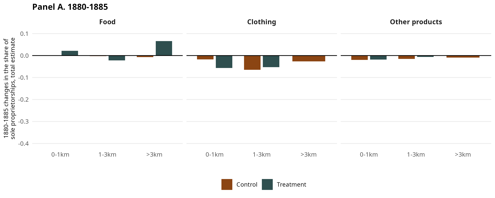
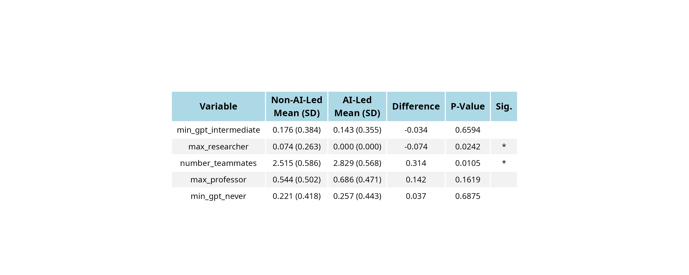

# Assignment 02 - BUSI333/ECON345
**Roll Number:** SIASUG23-0232  
**Date:** November 19, 2025

## Question 01

### (a)

Created a new column `ctgr` based on the `Pshr` column with the following categorization:
- **Food**: GRO, BAKER, FISH, FRUIT, PROV, PROD, CON, LIQ
- **Clothing**: CLO, B.S., DRYGOODS, HAT, MENFURN, MILLINER, TAILOR
- **Other Products**: All other values

### (b) 
 Successfully created the `dist` column categorizing distances into three bands.

### (c)
 Successfully transformed the `treat_band` column.

### (d)
 Successfully calculated `mSole` and filtered out groups with n < 20.

### (e)

 Successfully reshaped data and calculated `mSole_change = mSole_1885 - mSole_1880`.

### (f) 

Replicated Panel A of Figure 3 showing the 1880-1885 changes in the share of sole proprietorships across different distance bands and product categories.

**Graph:**

## Claude Code Prompts

1. *"Help me create R code to read a .dta file and filter for specific years"*
2. *"Create a ggplot bar chart with facets by category and dodged bars for treatment groups"*
3. *"How to reshape data from long to wide format in R (something from tidyverse)*

## Question 02 (30 Points)

### Balance Table

## Claude Code Prompts (Question 02)

4. *"Create a balance table in R comparing treatment and control groups with means, standard deviations, and t-tests"*
5. *"How to randomly select variables from a list in R"*
6. *"Write R script to convert a balance table into an image. Make it aesthetic"*

